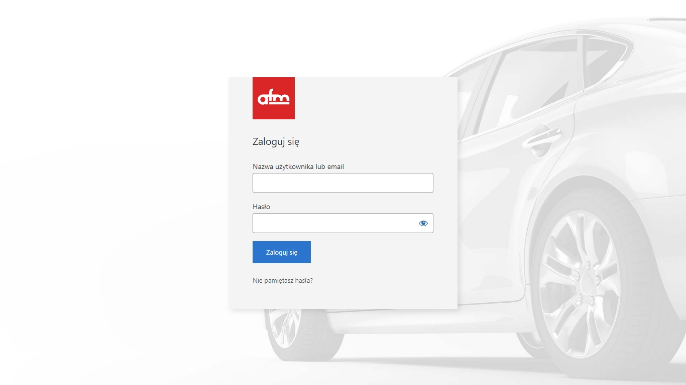
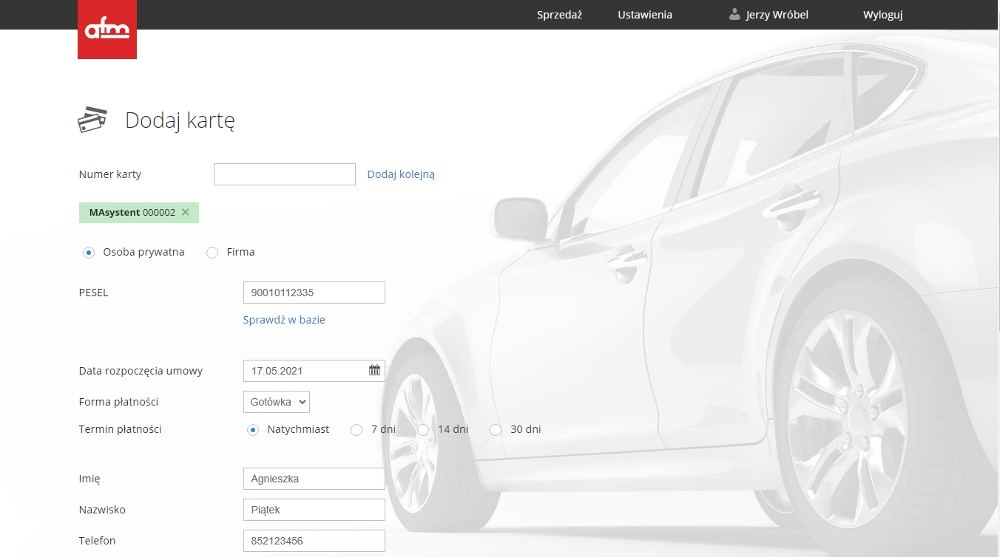
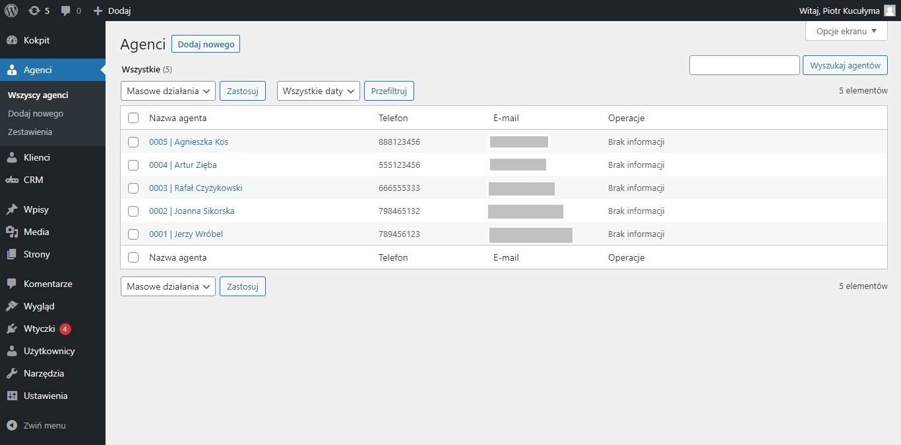
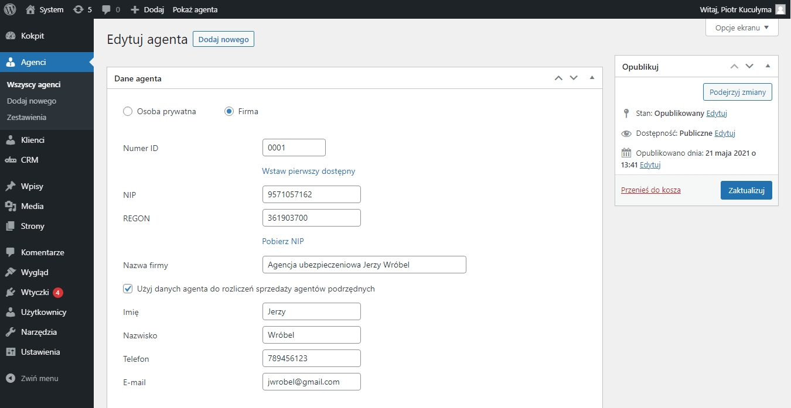
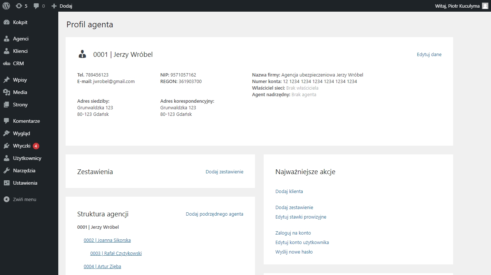
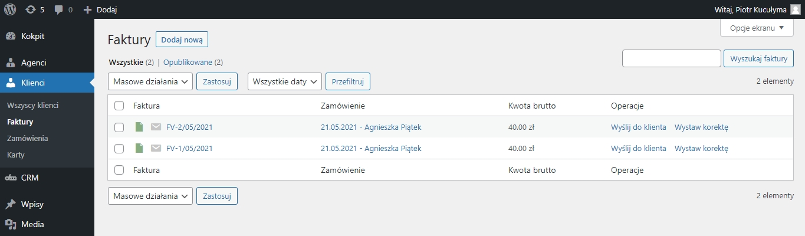
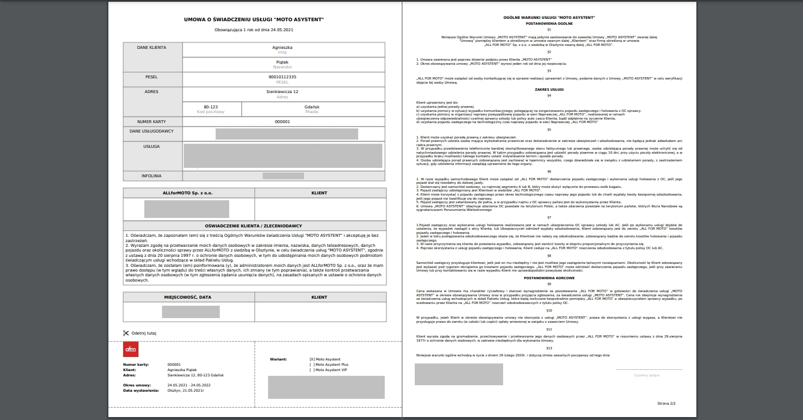

# Allformoto CRM
## About
Allformoto is insurance company based in Poland providing services for automotive industry. Project required software tools to manage sales and commisions for insurance agents.

## Features
Project implemented following features:
* Customer management
* Agents management
* Orders management
* Invoices generator (pdf)
* Contracts generator (pdf)
* Automatic emails via SMTP
* Managing agents' structures based on parent-child relationships (tree-like)
* Algorithm to calculate total commission based on sales list and predefined commission plans
* Branded login screen
* Custom wordpress theme for agents' area
* Custom wordpress plugin

## Agent area
Custom login screen:

  

Homepage - list of all sales:

  

Register new sale:

  

## Wordpress Admin

Agents list:

  

Create new agent:

  

Custom agent page:

  

Invocies:

  

Contract PDF

  

